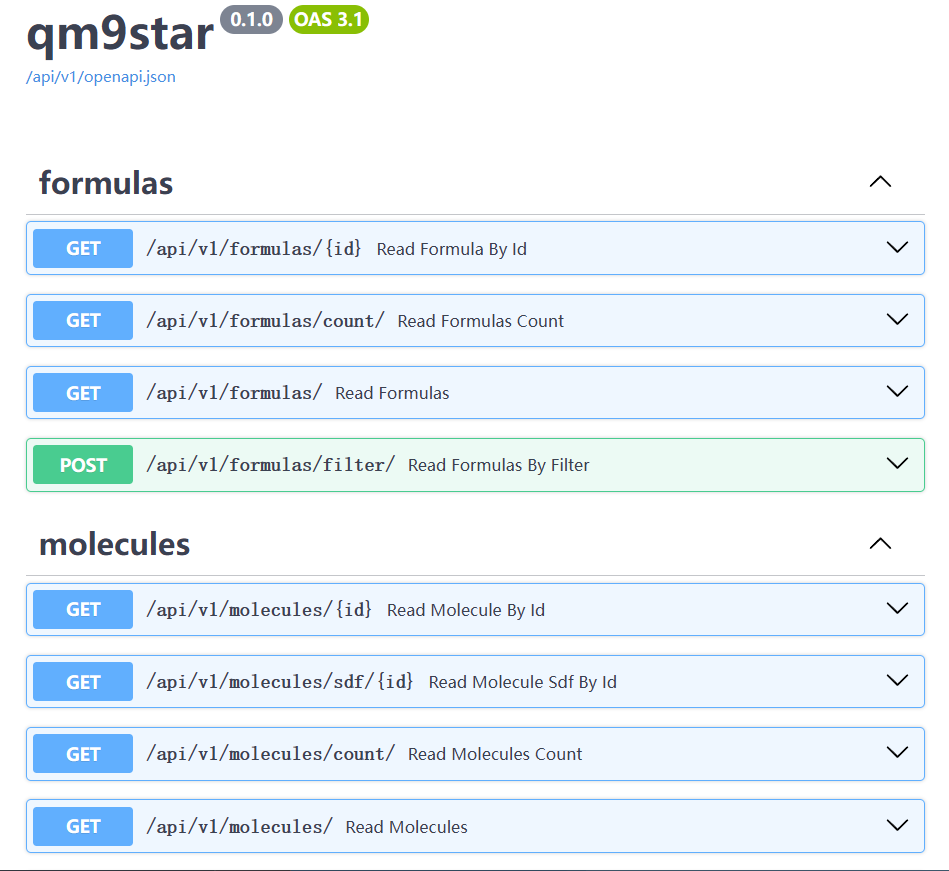

<!--
 * @Author: TMJ
 * @Date: 2024-04-29 09:59:49
 * @LastEditors: TMJ
 * @LastEditTime: 2025-02-04 13:32:16
 * @Description: 请填写简介
-->

# qm9star_query

A SQLModel-based repository dedicated to helping users access the PostgreSQL-based qm9star database more easily in a Python environment.

This is a repository for paper _"[QM9star, two million DFT-computed equilibrium structures for ions and radicals with atomic information](https://www.nature.com/articles/s41597-024-03933-6)"_.

## 2024.02 UPDATE Public API server is now available

Visit the [Online API server](#online-api-server) section to learn how to preview some data samples and run queries without self deployment.

## Usage

This repository requires a reasonably deployed QM9star database to run. For information on how to deploy a QM9star database, please refer to the [download_and_deploy_qm9star](tutorial/1-download_and_deploy_qm9star.md).

Once you have deployed correctly and checked network connectivity, you can refer to the [query_example](tutorial/2-query_example.ipynb) to run queries.

## Installation

### For users who only want to use the functions of connecting to databases and downloading datasets in this project, you can install the package following the steps below

```bash
git clone https://github.com/gentle1999/qm9star_query.git
cd qm9star_query
pip install poetry # if you don't have poetry installed
poetry install
```

### A demonstration guide on how to train neural network potential functions using the QM9star dataset is also provided in this project, and if you want to use these functions, you need to refer to the following steps

```bash
poetry install -E dl
```

If your cuda version not matches 12.1, you need to remove the dependencies of pyg-lib and other related packages. And then install them again with the correct cuda version. You can find the `whl` list on [pyg-lib](https://data.pyg.org/whl/index.html)

```bash
poetry remove pyg-lib torch-scatter torch-sparse torch-cluster torch-spline-conv torch-geometric
poetry add https://data.pyg.org/whl/torch-2.3.0%2Bcu121.html # Use correct cuda version
```

**Note**: If you excute `poetry install` without `--E dl` again, the extra dependencies will be removed.

### Failure Solution

- DIG dependency conflict

The `DIG` package contains a dependency called `rdkit-pypi`, which may overwrite the original higher version of rdkit when installing, if you encounter this problem, you can use the following methods to solve it.

```bash
poetry remove rdkit
poetry add rdkit
```

Poetry will consider these to be two packages, so it will check that they both exist, but we want the higher version of rdkit to override the lower one.

- Poetry stuck at pending

Sometimes Poetry's dependency resolution gets stuck in hellish wait times, which can be due to network or other reasons. In this case, you can try installing the dependency directly using the following command

```bash
pip install .
pip install .[dl] # If you want to use the dl functions
```

## API server

This repository also provides a simple API server for accessing the QM9star database.

### Online API server

The online API server is available at [https://star.asymcatml.net](https://star.asymcatml.net). You can access the documentation of the API server at [https://star.asymcatml.net/docs](https://star.asymcatml.net/docs)



### Self-host API server

First create an `.env` file in this folder with the following contents same as the configuration in the [1-download_and_deploy_qm9star](tutorial/1-download_and_deploy_qm9star.md):

```env
DOMAIN=127.0.0.1 # Change this to your domain name if needed
PROJECT_NAME="qm9star" # Change this to your project name
POSTGRES_SERVER=127.0.0.1 # Change this to your postgres server address
POSTGRES_PORT=35432 # Change this to your postgres port
POSTGRES_USER=hxchem # Change this to your postgres user
POSTGRES_PASSWORD=hxchem # Change this to your postgres password
POSTGRES_DB=qm9star # Change this to your postgres database name
```

Then you can start the server by running the following command:

```bash
poetry install -E api
poetry run uvicorn qm9star_query.run_api_server:app --reload --port 8000 --host 0.0.0.0 # Change the port and host as needed
```

You can then access the documentation of the API server at `http://localhost:8000/docs` to see the available endpoints and their parameters.

### Build API server docker image

To build the API server docker image, you can run the following command:

```bash
docker build -t qm9star_query_api .
```

Lateset official docker image is available on [GHCR](https://github.com/users/gentle1999/packages/container/package/qm9star_api).

## How to cite

```bibtex
@article{tangQM9starTwoMillion2024a,
  title = {{{QM9star}}, Two Million {{DFT-computed}} Equilibrium Structures for Ions and Radicals with Atomic Information},
  author = {Tang, Miao-Jiong and Zhu, Tian-Cheng and Zhang, Shuo-Qing and Hong, Xin},
  year = {2024},
  month = oct,
  journal = {Scientific Data},
  volume = {11},
  number = {1},
  pages = {1158},
  issn = {2052-4463},
  doi = {10.1038/s41597-024-03933-6},
  urldate = {2024-10-22},
  langid = {english}
}
```
