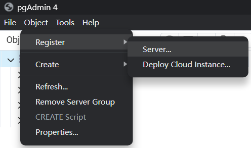
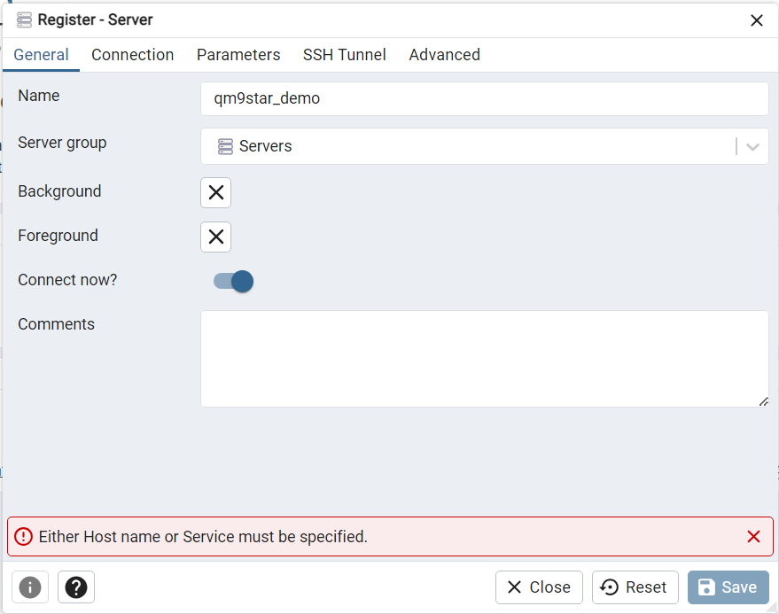
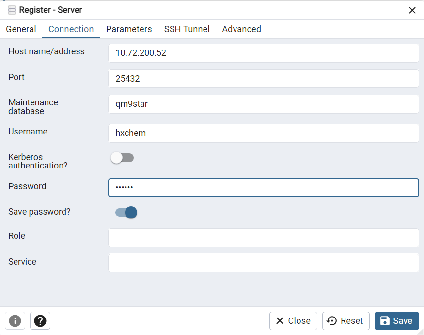
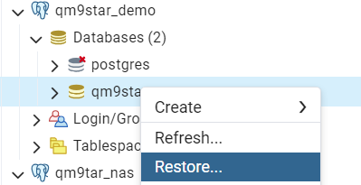
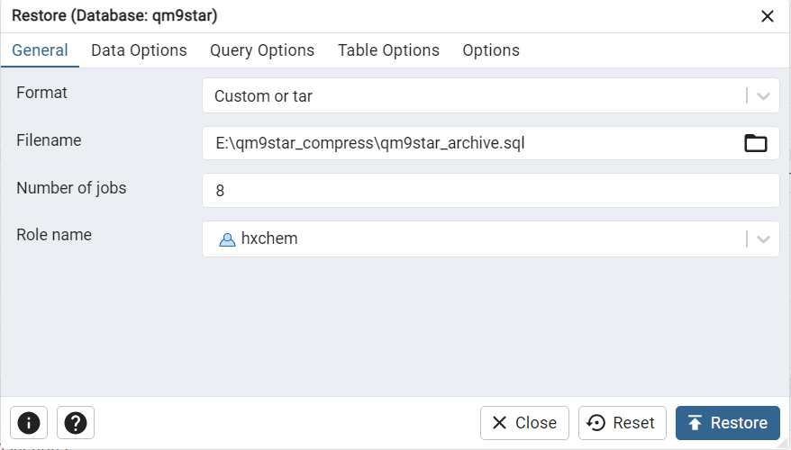
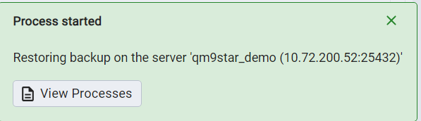
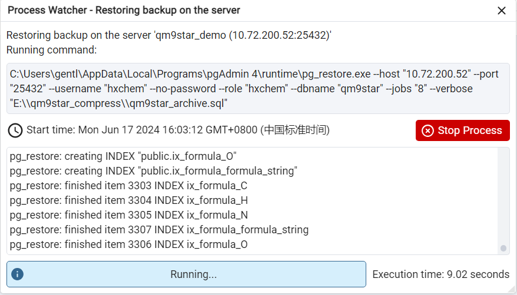

<!--
 * @Author: TMJ
 * @Date: 2024-04-29 16:14:07
 * @LastEditors: TMJ
 * @LastEditTime: 2024-09-13 11:30:39
 * @Description: 请填写简介
-->
# Download and deploy QM9\*

QM9\* is a reactive intermediate dataset, which is an extension of the QM9 dataset containing more than 2,000,000 molecular structures. This tutorial shows how to download and deploy the QM9* dataset. Our raw data dumps are available at [figshare](https://figshare.com/s/6906774d7d218d625978). You can download the data dumps from the link above. Then unzip the files.

## Install the environment

The dumps are PostgreSQL dumps. To use them, you need to install PostgreSQL (we recommend version 16) with pgvector extension, and a client to connect to it (we recommend pgAdmin 4). You can run PostgreSQL by Docker following the code below:

```bash
docker pull pgvector/pgvector:pg16
docker run -itd --name="qm9star" \ 
    # Use your own port
    -p 5432:5432 \ 
    # Use your own user and password
    -e POSTGRES_USER=hxchem \ 
    -e POSTGRES_PASSWORD=hxchem\ 
    # Set the inner port to 5432
    -e POSTGRES_PORT=5432 \ 
    # Create a default database
    -e POSTGRES_DB=qm9star \ 
    # Set the volumn path to disk, must be vaild
    -v <your/path/to/save/data>:/var/lib/postgresql/data \ 
    pgvector/pgvector:pg16
```

Of course, you can also use other methods to install PostgreSQL and pgvector extension. Docker is not necessary.

## Restore the dumps

We recommend using pgAdmin 4 to visualize the database connection. You can download pgAdmin 4 from [here](https://www.pgadmin.org/download/).

1. Create a new server connection.




2. Restore the dumps.





3. Wait for the restore to finish. (May take an hour or more)
  
## Connect to the database

You can use pgadmin 4 directly to access the contents of the database, but we recommend using the methods described in the next two sections.

- [2-query_example](https://github.com/gentle1999/qm9star_query/blob/main/tutorial/2-query_example.ipynb)
- [3-create_dataset](https://github.com/gentle1999/qm9star_query/blob/main/tutorial/3-create_dataset.ipynb)
